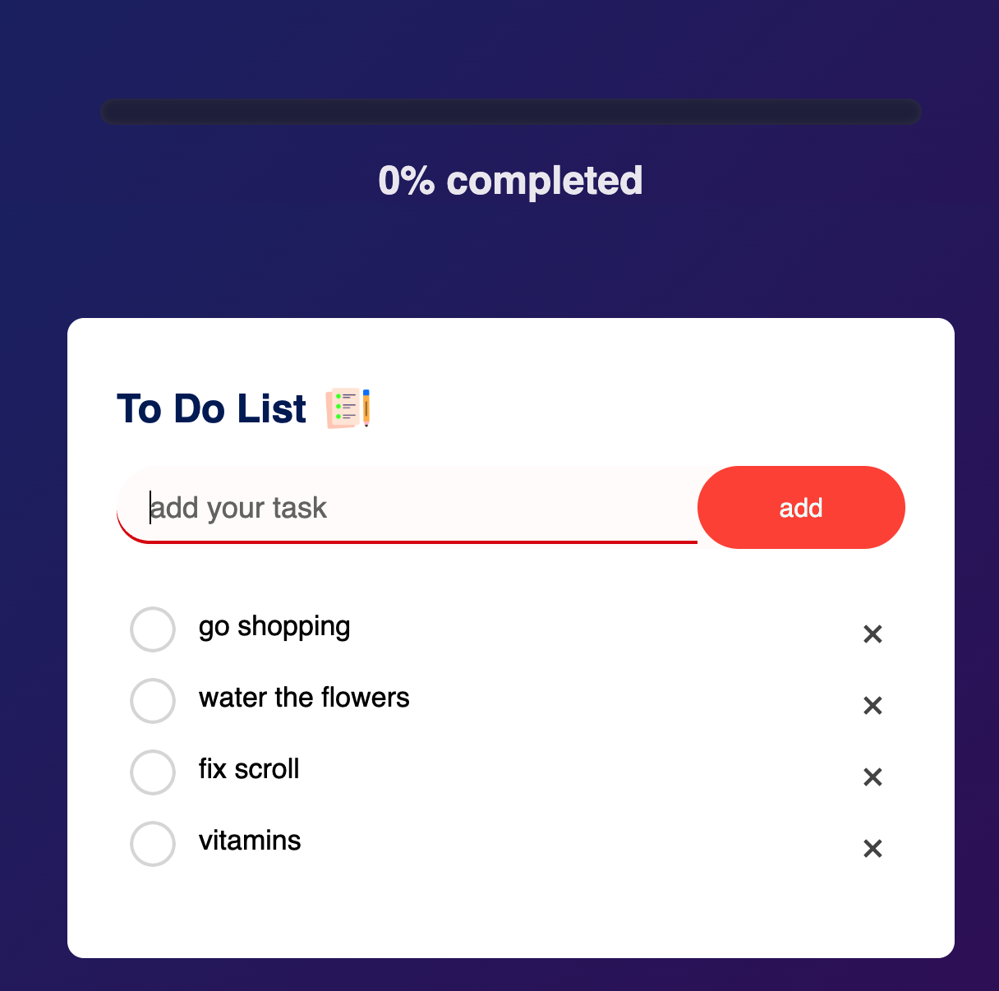
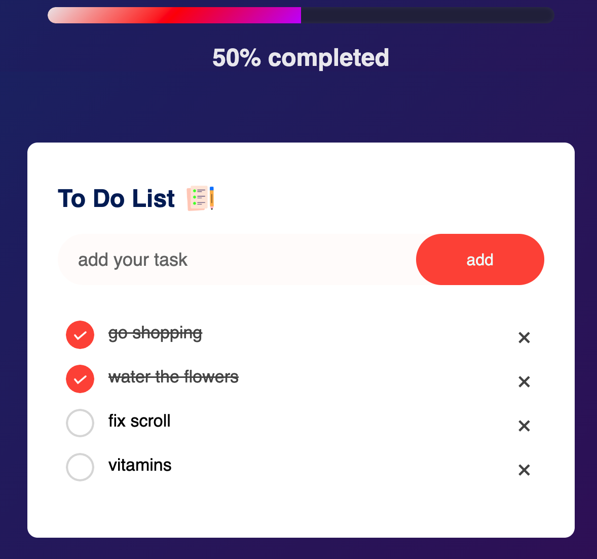
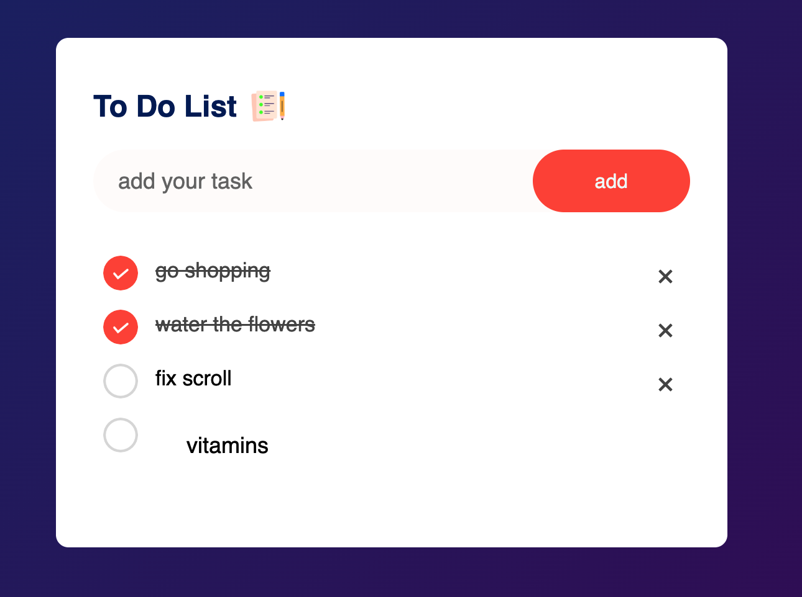

## 📝 To-Do List App

This is a simple yet stylish **To-Do List Web App** built with **HTML, CSS, and JavaScript**.
It allows users to add, check off, edit, and delete tasks — with a live **progress bar** that shows how many tasks are completed.
Your data is stored in **LocalStorage**, so the list stays saved even after refreshing the page.

### 🚀 Features

- ✅ Add new tasks
- 🗑 Delete tasks
- ✔ Mark tasks as completed
- ✏ Edit tasks by double-clicking
- 📊 Dynamic progress bar
- 💾 Persistent data (LocalStorage)
- 🎨 Responsive and clean UI

### 🛠 Tech Stack

- HTML5
- CSS3
- JavaScript (Vanilla)

### 📸 Screenshots

  
  
  

### 📂 How to Use

1. Clone the repository:

   ```bash
   git clone https://github.com/martasusenkova/To-Do-List-App-Using-HTML-CSS-And-JavaScript.git
   ```

2. Open `index.html` in your browser.
